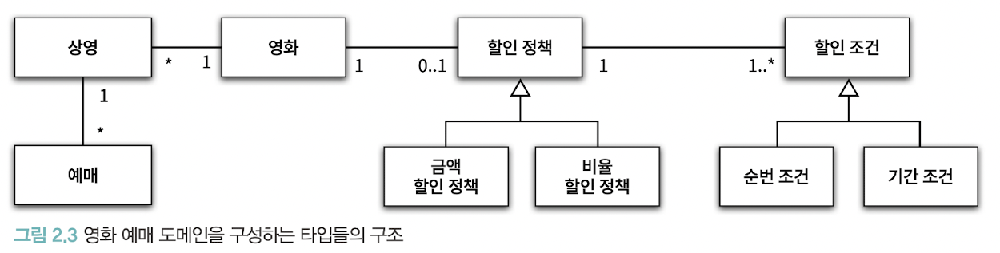
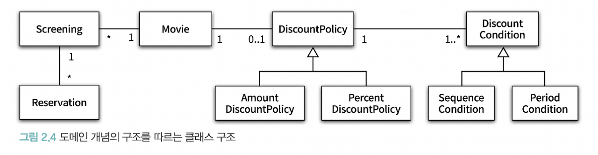
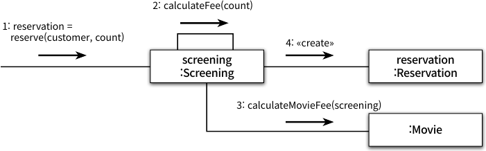
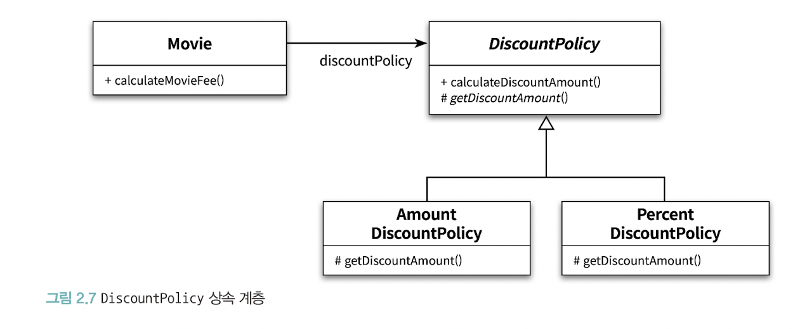
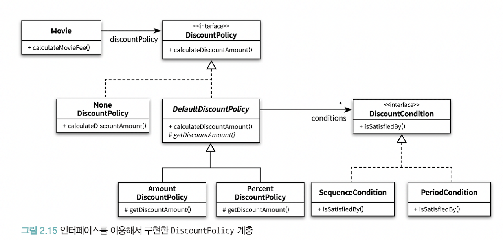
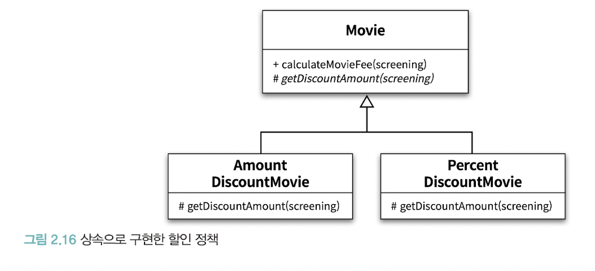

# Ch2 객체지향 프로그래밍

## 01 영화 예매 시스템
### 요구 사항 살펴보기
- 용어의 구분
    - 영화 : 영화에 대한 기본정보 (제목, 사영시간, 가격정보)
    - 상영 : 실제 관객들이 영화를 관람하는 사건 (상영일자, 시간, 순번)
    - 할인 조건(discountCondition): 가격의 **할인 여부** 결정
        - 순서조건: 상영 순번을 이용 
        - 기간조건: 요일, 시작시간, 종료시간으로 구성되어 영화 시작시간이 기간에 포함되면 할인
    - 할인 정책(discountPolicy): **할인 요금** 결정
        - 금액 할인 정책 : 일정 금액 할인
        - 비율 할인 정책 : 금액의 일정 비율 할인
- 할인관련 요구 사항
    - 할인 정책은 0,1개만 가능하다.
    - 할인 조건은 여러개가 가능하다.
    - 할인 조건이 만족되면 할안 정책을 적용한다.
    - 할인 조건이 만족되지 않으면 할인은 없다.
    - 할인 정책이 없으면 할인은 없다.

## 02 객체지향 프로그래밍을 향해
### 협력, 객체 클래스
- 객체는 클래스가 아니다
    - 객체지향은 어떤 클래스와 그 기반의 속성과 메서드를 결정하는 것이 아님
    - 클래스가 아닌 **객체**에 초점을 맞춰야함

1. 어떤 객체들이 필요한지 고민하라. 
    - 객체의 행동과 상태에 집중할 것
2. 객체는 협력하는 공동체의 일원이다.
    - 객체들의 모양과 윤곽이 잡히면 타입으로 분류하고, 타입 기반으로 클래스를 구현하라.

### 도메인의 구조를 따르는 프로그램 구조
- 도메인: 문제를 해결하기 위해 사용자가 프로그램을 사용하는 분야
- 객체지향 패러다임이 강력한 이유
    - 요구사항 분석 초기 단계부터 프로그램 구현 마지막 단계까지 객체라는 동일한 추상화 기법 적용 가능
    - 요구사항과 프로그램을 객체라는 동일한 관점에서 바라볼 수 있다
    - 도메인 구성 개념들이 객체와 클래스로 매끄럽게 연결된다

**영화 예매 도메인을 구성하는 타입들의 구조**

**도메인 개념의 구조를 따르는 클래스 구조**
- => 클래스 이름은 대응되는 도메인 개념의 이름과 유사하게, 관계도 유사하게 만들어야 프로그램의 구조를 이해하기 쉽고 예상하기 쉽다.

### 클래스 구현하기

**Screening 클래스**
- private, public 접근 제한자를 통해 경계 명확하게 구분 => 객체의 자율성 보장
~~~java
package org.eternity.movie.step01;

import org.eternity.money.Money;

import java.time.LocalDateTime;

public class Screening {
    private Movie movie;
    private int sequence; // 영화 순번
    private LocalDateTime whenScreened; // 상영 시작 시간

    public Screening(Movie movie, int sequence, LocalDateTime whenScreened) {
        this.movie = movie;
        this.sequence = sequence;
        this.whenScreened = whenScreened;
    }

    // 상영 시작 시간 조회
    public LocalDateTime getStartTime() {
        return whenScreened;
    }

    // 순번의 일치여부 검사
    public boolean isSequence(int sequence) {
        return this.sequence == sequence;
    }

    // 기본 요금 반환
    public Money getMovieFee() {
        return movie.getFee();
    }
}
~~~

#### 자율적인 객체
- 객체란?
    - 상태(state) + 행동(behavior) => '복합적인 존재'
    - 스스로 판단하고 행동하는 자율적인 존재
- 캡슐화와 접근제어
    - 캡슐화 : 데이터와 기능을 객체 내부로 함께 묶는 것
    - 접근제어를 위한 접근 수정자 : public, private, protected ...
    - 캡슐화의 접근제어의 기능 
        - 객체를 퍼블릭 인터페이스와 구현으로 분리 => **인터페이스와 구현의 분리 원칙**
            - public interface : 하나의 외부에서 접근 가능한 부분(public으로 지정된 메서드)
            - 구현(implementation): 오직 내부에서만 접근 가능(private/protected로 지정된 메서드/속성)
- 접근제어자 사용빙밥
    - public : 외부에 제공해야 하는 일부 메서드
    - private : 클래스의 속성
    - private, protected: 서브클래스나, 내부에서만 접근 가능한 메서드

#### 프로그래머의 자유
=> 프로그래머의 역할 **클래스 작성자**, **클라이언트 프로그래머**로 구분
- 클래스 작성자(class creator)
    - 인터페이스를 바꾸지 않는 한에서 내부 구현을 자유롭게함 => **구현은닉**
- 클라이언트 프로그래머(client programmer)
    - 필요한 클래스를 엮어서 애플리케이션을 빠르고 안정적으로 구축
- 접근 제어 메커니즘
    - 클래스의 내부와 외부를 명확하게 경계를 지어줌으로써, 클래스 작성자가 내부 구현을 은닉할 수 있게 해준다.
    - 클라이언트 프로그래머가 실수로 숨겨진 부분에 접근하는 것을 막아준다.
- 구현 은닉
    - 내부의 구현은 무시한 채 인터페이스만 알고 있어도 클래스를 사용할 수 있다.
    - 클래스 작성자가 인터페이스를 바꾸지 않는 한 내부 구현을 마음대로 변경할 수 있다.

### 협력하는 객체들의 공동체
**금액과 관련된 다양한 계산을 구현한 Money**
~~~ java
public class Money {
    public static final Money ZERO = Money.wons(0);

    private final BigDecimal amount;

    public static Money wons(long amount) {
        return new Money(BigDecimal.valueOf(amount));
    }

    public static Money wons(double amount) {
        return new Money(BigDecimal.valueOf(amount));
    }

    Money(BigDecimal amount) {
        this.amount = amount;
    }

    public Money plus(Money amount) {
        return new Money(this.amount.add(amount.amount));
    }

    public Money minus(Money amount) {
        return new Money(this.amount.subtract(amount.amount));
    }

    public Money times(double percent) {
        return new Money(this.amount.multiply(BigDecimal.valueOf(percent)));
    }

    public boolean isLessThan(Money other) {
        return amount.compareTo(other.amount) < 0;
    }

    public boolean isGreaterThanOrEqual(Money other) {
        return amount.compareTo(other.amount) >= 0;
    }
}
~~~
- 1장에서는 금액을 구현하기 위해 Long 타입을 사용
- Long 타입은 변수의 크기같이 구현 관점의 제약은 표현할 수 있지만 
- Money 타입처럼 저장하는 값이 금액과 관련돼 있다는 의미를 전달할 수는 없다. 
- 금액과 관련된 로직이 서로 다른 곳에 중복되어 구현되는것을 막을 수 없다.
- => 객체지향의 장점은 Money처럼 객체를 이용해 도메인의 의미를 풍부하게 표현할 수 있다는 것이다.

**영화를 예매하기 위한 Reservation**
~~~java
public class Reservation {
    private Customer customer;
    private Screening Screening;
    private Money fee;
    private int audienceCount;

    
public Reservation(Customer customer, Screening Screening, Money fee, int audienceCount) {
    this.customer = customer;
    this.Screening = Screening;
    this.fee = fee;
    this.audienceCount = audienceCount;
    }
}
~~~
- 영화를 예매하기 위해 Screening, Movie, Reservation 인스턴스들은 서로의 메서드를 호출하며 **상호작용**한다. 
- 시스템의 어떤 기능을 구현하기 위해 **객체들 사이에 이뤄지는 상호작용 == 협력(Collaboration)**

**Screening, Reservation, Movie 사이의 협력**

### 협력에 관한 짧은 이야기
- 객체간 상호작용 방법
  - 메시지를 전송(send a message)하는 것
  - 메시지를 수신(receive a message)받는 것
- 메서드(method): 객체가 수신된 메시지를 처리하기 위한 방법
- 다형성(polymorphism): 메시지와 메서드를 구분하는 것이 다형성의 개념 출발

## 03 할인 요금 구하기
### 할인 요금 계산을 위한 협력 시작하기
~~~ java
public class Movie {
    private String title;
    private Duration runningTime;
    private Money fee;
    private DiscountPolicy discountPolicy;

    public Movie(String title, Duration runningTime, Money fee, DiscountPolicy discountPolicy) {
        this.title = title;
        this.runningTime = runningTime;
        this.fee = fee;
        this.discountPolicy = discountPolicy;
    }

    public Money getFee() {
        return fee;
    }

    public Money calculateMovieFee(Screening screening) {
        return fee.minus(discountPolicy.calculateDiscountAmount(screening));
    }
}
~~~
**할인 요금 계산 method(calculateMovieFee)**
- 어떤 할인 정책을 사용할 것에 대한 코드는 존재하지 않음
- discountPolicy에게 메시지를 전송할 뿐임
- => 상속, 다형성 추상화의 원리가 숨어져 있음

### 할인 정책과 할인 조건

~~~ java
public abstract class DiscountPolicy {
    private List<DiscountCondition> conditions = new ArrayList<>();
    
    public DiscountPolicy(DiscountCondition ... conditions) {
        this.conditions = Arrays.asList(conditions);
    }
    
    // 할인 조건 만족 여부를 확인하여 할인 금액 반환
    public Money calculateDiscountAmount(Screening screening) {
        for(DiscountCondition each : conditions) {
            if(each.isSatisfiedBy(screening)) {
                return getDiscountAmount(screening);
            }
        }
        return Money.ZERO;
    }
    // 실제 금액을 계산하는 method, 
    // 금액 or 비율 정책을 구현하는 자식 클래스에서 상속받아 구현
    abstract protected Money getDiscountAmount(Screening Screening);
}
    
~~~
- 할인 정책은 금액 할인 정책과 비율 할인 정책으로 구분
- 부모 클래스(DiscountPolicy)에 중복 코드를 두고 AmountDiscountPolicy, PercentDiscountPolicy가 상속받도록 구현
- TEMPLATE METHOD: 부모 클래스에 기본적인 알고리즘의 흐름을 구현하고 중간에 필요한 처리를 자식 클래스에게 위임하는 디자인 패턴

### 할인 정책 구성하기
**요구 사항 조건 강제화하기**
- 요구사항 조건
  - 하나의 영화에 대해 단 하나의 할인 정책만 설정 가능
  - 할인 조건은 여러개 적용 가능
- 강제화 방법
  - Movie의 생성자를 하나의 DiscountPolicy 인스턴스만 받을 수 있도록 선언
  - DiscountPolicy의 생성자는 여러 DiscountCondition을 허용하도록 선언

## 04 상속과 다형성
### 컴파일 시간 의존성과 실행 시간 의존성

Movie의 의존관계
- Movie는 추상 클래스인 DiscountPolicy와 연결되어 있지만, 필요한건 그 자식 클래스의 인스턴스임
- Movie 인스턴스를 생성할 때 인자로 구체화된 자식 인스턴스를 전달하면 됨
- 코드상 Movie는 오직 DiscountPolicy만 의존
- 실행 시점은 인스턴스에 의존 

객체의 의존성 양면성
- 클래스 사이의 의존성과 객체 사이의 의존성은 동일하지 않을 수 있다.
- 장점: 코드의 유연성과 확장성 증가
- 단점: 코드를 이해하기 어렵게 만듦
- 설계가 트레이드 오프의 산물이라는 것을 보여준다.
- 재사용성, 확장 가능성과 디버깅 용이성의 트레이드 오프다.

### 차이에 의한 프로그래밍
- 부모 클래스와 다른 부분만을 추가해서 새로운 클래스를 쉽고 빠르게 만드는 방법

### 상속과 인터페이스
- **상속의 목적**
  - 공통 알고리즘, 공통 인터페이스 사용(O)
  - 메서드나 인스턴스 변수 재사용(X)

- **업캐스팅**: 자식 클래스가 부모 클래스를 대신하는 것
  - 자식 클래스는 상속을 통해 부모 클래스의 인터페이스를 물려받기 때문에 부모 클래스 대신 사용될 수 있음 
  - 상속을 통해 자식은 부모가 수신할 수 있는 모든 메세지를 수신할 수 있다. 
  - 즉 **책임을 이어받는다.**

### 다형성
- 실행 시점에 동일한 메세지를 전송해도 어떤 메세지가 실행될 지는 메세지를 수신하는 객체의 클래스에 의해 달라짐을 의미
- 동일한 메시지를 수신했을 때 객체 타입에 따라 다르게 응답할 수 있는 능력
- 컴파일 시간 의존성(코드-추상클래스/인터페이스)와 실행시간 의존성(인스턴스-구체클래스)이 다를수 있다는 것을 기반으로 함
- 지연/동적 바인딩: 메시지와 메서드를 실행 시점에 바인딩
- 초기/정적 바인딩: 컴파일 시점에 실행될 함수와 프로시저를 결정하는것

### 인터페이스와 다형성
- 순수하게 인터페이스만 공유하고 싶을 때 인터페이스 사용

## 05 추상화와 유연성
### 추상화의 힘 (장점)

1. 추상화의 계층만 따로 살펴보면 요구사항의 정책을 높은 수준에서 서술 가능하다.
   - 위 그림을 통해 영화 예매 요금은 최대 하나의 할인 정책과 다수의 할인 조건을 이용해 계산할 수 있다를 나타냄
   - 협력 다이어그램을 통해 명확해짐 
2. 설계가 유연해짐
   - 기존 구조를 수정하지 않고 하위타입을 통해 기능 추가/변경 가능

### 유연한 설계
~~~java
public class NoneDiscountPolicy implements DiscountPolicy {
    @Override
    public Money calculateDiscountAmount(Screening screening) {
        return Money.ZERO;
    }
}

Movie starWars = new Movie("스타워즈",...,new NoneDiscountPolicy());
~~~
- 추상화를 통해 NoneDiscountPolicy를 구현 -> 기존 클래스의 수정없이 할인 정책이 없는 영화 생성가능
- 추상화가 유연할 설계를 가능하게 하는 이유는 설계가 구체적인 상황에 결합되는 것을 방지하기 때문
- Movie는 특정한 할인 정책에 묶이지 않는다. 
- 할인 정책을 구현한 클래스가 DiscountPolicy를 상속 받고 있다면 어떤 클래스와도 협력이 가능하다. => 컨텍스트 독립성
- 유연성이 필요한 곳에 추상화를 사용할 것

### 추상 클래스와 인터페이스 트레이드오프
~~~java
public abstract class DiscountPolicy {
    private List<DiscountCondition> conditions = new ArrayList<>();

    public DiscountPolicy(DiscountCondition ... conditions) {
        this.conditions = Arrays.asList(conditions);
    }

    public Money calculateDiscountAmount(Screening screening) {
        for(DiscountCondition each : conditions) {
            if (each.isSatisfiedBy(screening)) {
                return getDiscountAmount(screening);
            }
        }

        return Money.ZERO;
    }

    abstract protected Money getDiscountAmount(Screening Screening);
}
~~~
**위 코드의 문제점** 
1. NoneDiscountPolicy는 할인조건이 없어 calculateDiscountAmount 메세지가 호출되지 않음. 
2. DiscountPolicy와 NoneDiscountPolicy를 개념적으로 결합됨;
   - NoneDiscountPolicy가 0원을 반환할 것이라는 사실을 가정하기 때문

**변경한 설계**

- 혼란과 결합을 제거할 수 있음
- 설계 자체가 가독성 측면에서 과할 수 있음
- => 구현에 있어 어떤 설계가 더 좋은지를 고민/판단하여 트레이드 오프 할 것

### 상속
**상속으로 구현한 할인 정책**

- 상속
    - 코드 재사용을 위한 방법(x)
    - 부모 객체 인터페이스의 재사용을 위한 방법(o)
- 상속의 단점
    1. 상속이 캡슐화를 위반함
        - 상속을 위해선 부모 클래스의 내부구조를 알고 있어야 함 (부모클래스의 구현 -> 자식클래스로 노출)
        - 부모-자식 클래스 간의 결합이 강화되어 코드의 변경이 어려워짐
    2. 설계를 유연하지 못하게 함
        - 부모-자식 클래스 관계를 컴파일 시점에 결정함
        - 실행 시점에 객체의 종류 변경이 불가능함 -> 합성의 경우에는 변경 method를 구현하면 가능함

### 합성
- 합성: 인터페이스에 정의된 메시지를 통해서만 코드를 재사용하는 방법 
- 합성의 장점
  - 효과적인 캡슐화: 인터페이스의 내부 로직은 알지 못함
  - 설계의 유연화: 의존하는 인터페이스를 교체하기 쉬움
  - 느슨한 결합도: 클래스가 아닌 메시지를 통해서만 결합됨

=> 동일한 코드를 재사용하는 경우에는 상속보다 합성을 선호하는 것이 옳지만 다형성을 위해 인터페이스를 재사용하는 경우에는 상속과 합성을 둘 다 사용하는 것이 좋다.